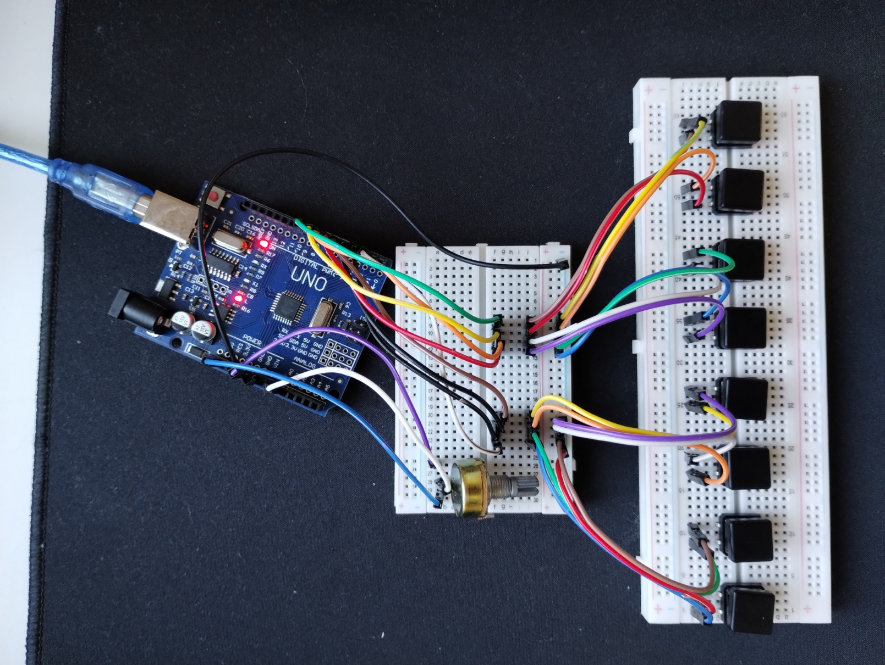

# A simple MIDI Controller (digital piano) using Arduino Uno.

### Features:
    - piano keys,
    - volume potentiometer,
    - a standalone program in C that works as a bridge between Arduino's serial and a MIDI port

### Creating a MIDI port
#### To create a virtual MIDI port, I used a program called [loopMIDI](https://www.tobias-erichsen.de/software/loopmidi.html)

### How does it work?
#### Arduino sends MIDI-like signals through serial port, that are then read by serial_to_midi C program, converted to MIDI signals and sent over selected MIDI port.

#### This solution suffers from [debouncing](https://www.techtarget.com/whatis/definition/debouncing). If you wanted to upgrade it a bit, you could use something like a [Schmitt Trigger](https://en.wikipedia.org/wiki/Schmitt_trigger) to get rid of it.

https://youtu.be/5DVNKoiFiPI
